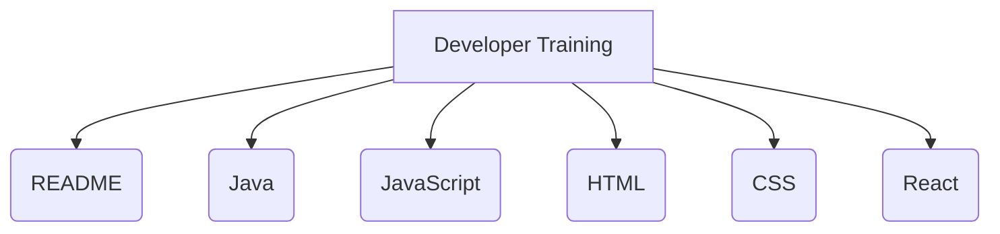
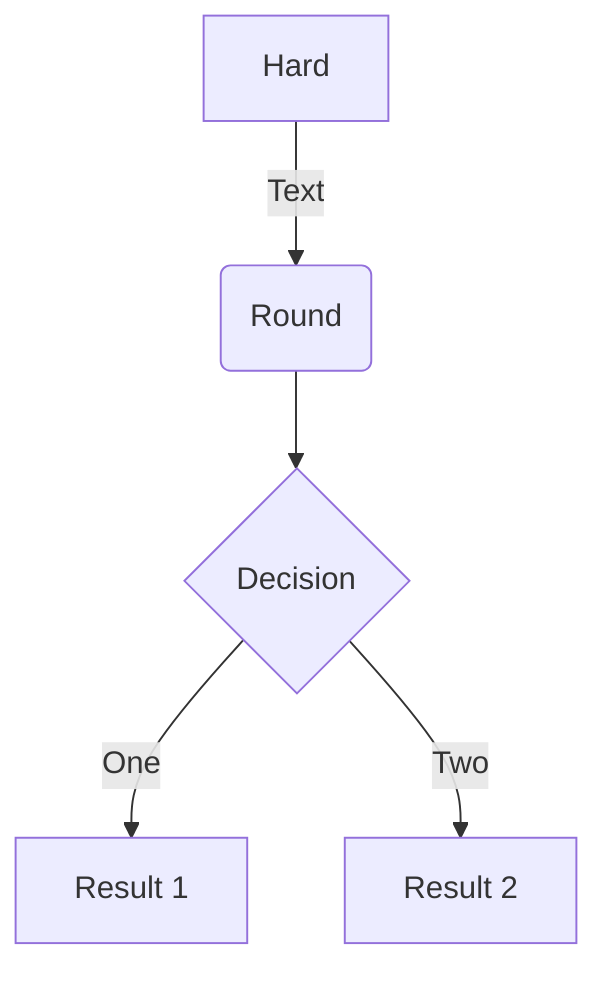
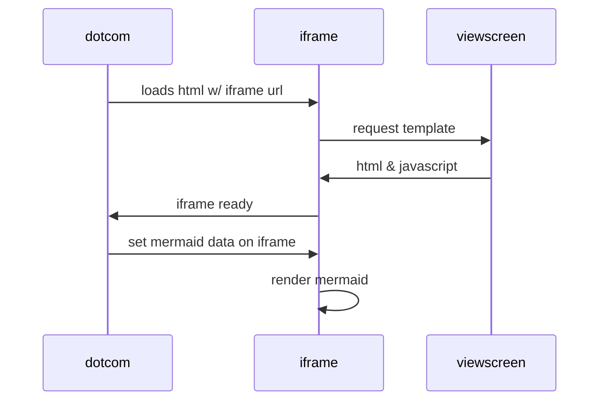

# graphtd
repo to test graphtd

```mermaid
graph TD;
  A[Developer Training] --> B(README);
  A --> C(Java);
  A --> D(JavaScript);
  A --> E(HTML);
  A --> F(CSS);
  A --> G(React);
```

flowchart LR

```mermaid
graph TD;
A[Hard] -->|Text| B(Round)
B --> C{Decision}
C -->|One| D[Result 1]
C -->|Two| E[Result 2]
```

```mermaid
sequenceDiagram
    participant dotcom
    participant iframe
    participant viewscreen
    dotcom->>iframe: loads html w/ iframe url
    iframe->>viewscreen: request template
    viewscreen->>iframe: html & javascript
    iframe->>dotcom: iframe ready
    dotcom->>iframe: set mermaid data on iframe
    iframe->>iframe: render mermaid
```
